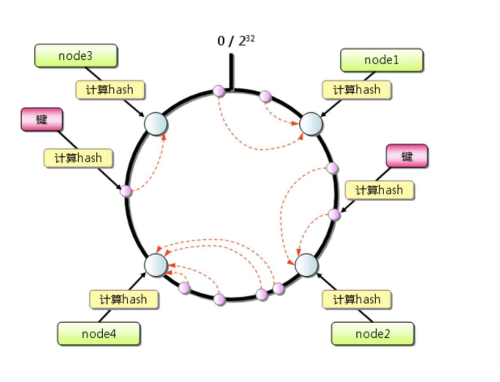
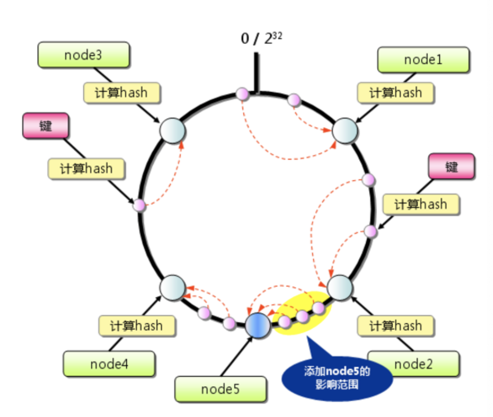

常见的服务器负载均衡方法- 一致性哈希

## 一致性哈希

一致性哈希在分布式系统中得到较多的应用

**背景**

在服务器接受前端的请求消息时，会经过哈希函数映射到响应的服务器上，实现负载的均衡
但是在扩充机器或者删除个别服务器后，会导致大量的数据进行迁移(全部重新计算),服务器的负载也会出现不均衡的情况

需要解决的问题是

- 使数据迁移量低
- 各服务器的负载均衡

**虚拟结点技术**

使用虚拟结点来进行结点资源的抢占

**早期的一致性哈希**

- 1.先求出服务器结点的哈希值,并配置到0～2^32的圆上
- 2.同样的方法求出数据键值的哈希值，并映射到圆上
- 3.数据映射的位置开始顺时针进行查找，将数据保存到第一个遇到的服务器上

- 4.添加服务器，余数分布式服务器由于保存键的服务器会改变，影响命中率。在圆(continuum)上增加服务器的地点逆时针方向的第一台服务器会收到影响。

**一致性哈希的性质**

分布式系统中，每个结点都有可能失效，并且新的结点很可能动态的增加进来，如何保证当前系统结点数目发生变化仍能够对外提供良好的服务。

- 1.平衡性(balance)

- 2.单调性(Monotonicity)

- 3.分散性(spread)

- 4.负载(load)

- 5.平滑性(smoothness)

**原理**

一致性哈希将真个哈希值空间组织成一个虚拟的圆环，假设空间

就是用来解决机器负载不均匀，导致的数据倾斜问题

一致性哈希算法引入虚拟结点机制，每一台机器通过哈希函数计算出多个哈希值,在多个位置都放置一个服务结点,成为虚拟结点

通过在机器ip或主机名的后面增加编号或端口来实现
