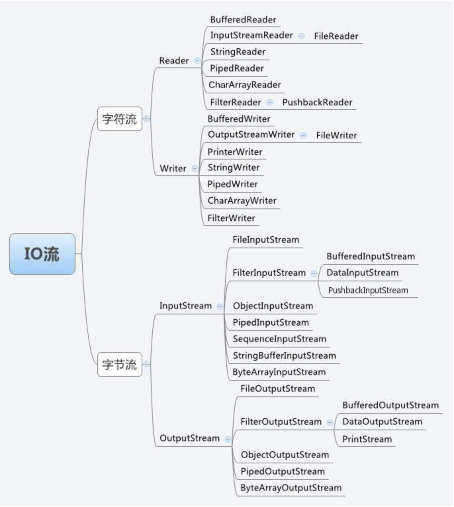

## java基础知识


### 1.概念基础

java是字节码(解释性语言),通过JVM运行在虚拟机中

源代码--字节码--运行

通过对JVM的使用，只要写一次程序，就可以在任何地方，任何地点运行程序

字节码可以实现程序的  **可移值性**,**持久性**

类名必须与源文件名称相同, 必须使用.java的文件拓展名,java区分大小写

所有代码都必须驻留在类中

java是不支持或者不允许指针


**数据类型**

java程序可以识别并使用.java文件

- 在同一目录下
- 标准的java库中
- 可以import的语句
- classpath机制


**标识符的定义**

- 可以有数字，大小写字母，下划线，美元符号组合
- 但是不可以由一个数字开始

```java
//              //单行注释
/* */           //多行注释
/** */          //文档注释

System.out.print();
System.out.println();    // 自动添加换行
```

### 2.面向对象

**对象**:承载数据类型的值的实体

对象的三大特性

- 状态,就是对象的值
- 标识，区别对象(内存中位置)
- 行为,数据类型的操作

java的核心就是面向对象

- abstract 抽象来解决复杂性
- Inheritance 层级分类来管理抽象

**实例方法，静态方法**

实例方法- (小写字母)是对对象名的调用
静态方法- (大写字母)类名

java中每个程序的实现都是某种数据类型或静态方法库

**三大原则**

- 1.Encapsulation 封装 ,封装的基本单元是一个类(定义一个对象集共享结构的行为 代码+数据)

- 2.Inheritance   继承，支持按层级进行分类

- 3.Polymorphism  多态


**数据类型设计**

面向对象:就是使用数据类型封装数据(简化实现，隔离用例开发代码)

**接口继承，继承**

接口继承，允许通过指定一个含有一组公共方法的接口为两个本来没有关系的类建立一种联系
两个类都必须实现这些方法  (子类型)

继承,子类


### 3.运算符

- 算术运算

- 位运算

- 关系运算

- 逻辑运算


### 4.类

类是对象的模板template,对象是类的一个实例

当一个实例变量，不是被该实例变量所在类的部分代码访问时，必须对该对象加上点运算符来计算

所有的代码都应该写到类中

**构造函数**

一个对象创建的时候进行初始化

this关键字 ，一个对象需要引用调用它的对象

this总是调用该方法对象的一个引用

**收尾机制**
finalization

一个类增加收尾 finalize()，这个函数会确保在垃圾回收前被调用

**重载**

函数重载会根据参数类型和数量来进行区分

返回类型不足以区分所使用的方法

找不到匹配的参数，会使用参数的自动转换

**参数传递**

call-by-value
call-by-reference

创建一个类类型的变量时，仅仅是创建类一个类的引用

对象是通过引用传递的

- 简单类型，按值传递
- 对象传递，引用传递

**访问控制**

access control

access specifier 访问指示符

public,private,protected(继承中多使用)

不指示访问说明符 int a; 这个成员默认访问设置为包内 public,但是在包以外不能被存取

**static**

定义一个类成员，完全独立于该类的任何对象

类成员必须通过它的类的对象访问，
但是使用static关键字，可以创建一个成员，能被自己使用，不必引用特定的实例
static 能够在其类任何对象创建之前被访问，不必引用任何对象

static块在类加载时候执行一次

static 声明独立于对象的静态变量，无论一个类实例化多少个对象，静态变量只有一份拷贝

静态方法，静态方法不能使用类的非静态变量

**final**

一个变量声明为final，阻止其变量内容被修改(C/C++中的const)
对于函数还有final方法

**String**

java中处理字符串最重要的类

String 一旦创建一个对象，内容是不可以改变的
StringBuffer ，是不可以改变的

String可以组成字符数组


### 5.继承

继承是面向对象的基石

创建分层等级的类

superclass 超类

subclass 子类

java不支持多超类继承

**super**
- 1.超类构造函数，必须在子类构造函数的第一句,子类调用super，直接调用超类构造函数
- 2.super-member 超类中被子类隐藏的成员 

**重载 override**

覆盖，子类于超类中的方法的名称和类型都是相同的，子类会覆盖超类

动态方法调度  dynamic method dispatch

一种运行时，而不是编译时，调用重载方法的机制，实现运行是多态的基础（run-time polymorphism）

超类的引用变量可以引用子类对象

**抽象类**

创建一个只定义一个被它所有子类共享的通用形式，由每个子类填写细节

抽象方法  abstract method

抽象类没有对象，不能通过new直接实例化

但是可以创建一个引用变量

**final**

阻止重载   final method
阻止继承   final class

一个类即是abstract 又是final是不合法的

**object**

所有其他类的超类

一个object类型的引用变量可以引用其他任何一个类的对象


### 6.包和接口

package 包:类名空间划分机制,可见度控制机制

引入包 import

import java.util.*;


interface 接口: 类的实现中抽象一个类的接口

接口的定义很像类的定义，接口可以将类层次中分开

一旦定义接口，一个或多个类可以实现接口

Random 提供随机数，nextDouble()方法 0.0～1.0之间的随机数

**任何实现接口interface的类必须实现该接口定义的所有方法，包括从其他接口继承的任何方法**


### 7.异常处理

exception 

希望自己处理异常  try，catch

异常引发，程序控制从try转移到catch块

执行永远不会从catch块返回到try模块

try-catch  允许修正错误，防止程序自动终止

catch语句的目的就是解决异常，并且像错误没有发生一样继续运行

使用多catch语句的时候，异常子类必须在其任何父类之前使用，父类会捕获该类型及其所有子类型的异常

throw 引发明确的异常

**throws**

如果一个方法可以导致一个异常但是不处理它，它必须指定这种行为让方法的调用者可以抱他它们自己而不发生异常


### 8.多线程编程

multithreaded programming

java多线程优点在于取消了 主循环/轮询机制

thread t 在线程组中的输出

```java
class CurrentThreadDemo
{
    public static void main(String args[])
    {
        Thread t=Thread.currentThread();
        System.out.println("current thread :"+t);

        // change the name of thread
        t.setName("my thread");
        System.out.println("current thread:"+t);

        try{
            for (int n=5;n>0;--n){
                System.out.println(n);
                Thread.sleep(1000);              // dealy 1 ms
            }
        }catch(InterruptedException e){
            System.put.println("Main thread interrupted");
        }
    }
}

```

thread 的类型组成是 (线程名称+优先级+组的名称)

线程组  thread group 是一种将线程作为一个整体集合的状态控制数据结构

通过实例化一个Thread对象来创建一个线程

- 实现implement Runnable接口
- 可以继承Thread类


**继承Thread类实现创建线程**

- 1.写一个Thread的子类，重写run方法(执行的结构体)
- 2.新建一个子类的实例，线程对象
- 3.线程对象调用start()方法来实现运行


**实现Runnable接口来创建新线程**

- 1.实现Runnable接口，重写run方法，线程的结构体
- 2.创建Runnable实现类的实例，作为Thread的target来创建对象,线程对象
- 3.调用线程的start()方法来启动该线程


**通过Callable 和Future创建线程**

- 1.创建callable接口实现类，实现call()方法,执行体,并且就有返回值
- 2.创建callable实现类的实例，使用FutrueTask进行包装callable对象
    FutureTask对象封装 该callable对象的call()方法返回值

- 3.使用FutureTask对象作为Thread对象的target创建并启动线程
- 4.调用FutureTask对象的get()方法来获得子线程执行结束的返回值


各种方法的优劣势:

继承Thread方法,
优势在于编写简单，无需使用Thread.currentThread()方法
劣势就是继承了Thread类，无法继承其他的类


Callable和Futrue方法

优势:只是实现接口，还可以继承其他类,多线程可以共用一个target对象，适合多个线程来处理同一份资源
劣势:编程较复杂，访问当前线程必须使用 Thread.currentThread()


isAlive(),join()


线程之间的通信

wait(),notify(),notifyall()

wait()告知被调用的线程放弃管程直到其他线程进入相同管程调用notify()

notify() 恢复相同对象第一个调用wait()的线程

### 9.输入/输出



Scanner有很多种方法

```java
import java.util.Scanner

Scanner scan=new Scanner(System.in);

// next 方法
if(scan.hasNext())
    string a=scan.next();

// nextLine
if(scan.hasNextLine())
    string b=scan.nextLine();

// 输入数字

scan.hasNextInt     // nextInt
scan.hasNextFloat   // nextFloat
scan.hasNextDouble  // nextDouble

```

next() 与 nextLine() 区别
next():
1、一定要读取到有效字符后才可以结束输入。
2、对输入有效字符之前遇到的空白，next() 方法会自动将其去掉。
3、只有输入有效字符后才将其后面输入的空白作为分隔符或者结束符。
next() 不能得到带有空格的字符串。
nextLine()：
1、以Enter为结束符,也就是说 nextLine()方法返回的是输入回车之前的所有字符。
2、可以获得空白。


**读写文件**

继续学习


### 10.小应用程序applet

applet是一个全功能的java应用程序


