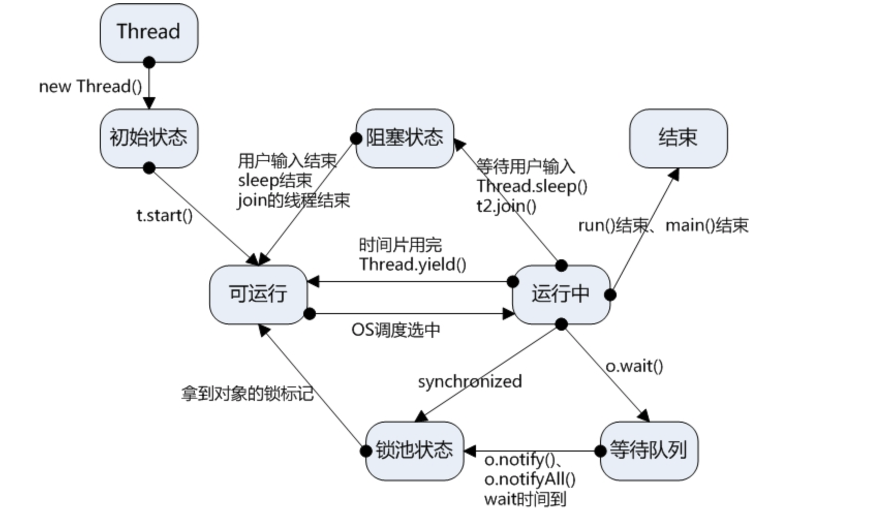

## 并发


### 1.基础知识

**进程**:进程有独立的代码和数据空间(进程上下文)，进程间切换会有巨大的开销，进程是进行资源分配的最小单位

**线程**:同一类线程共享代码及数据空间，线程有独立的运行栈和pc计数器，线程的切换开销小，线程是cpu进行调度的最小单位


**主线程**:JVM调用程序main()所产生的程序

**当前线程**:Thread.currentThread()获取当前线程

**后台线程(守护线程)**:为其他线程提供服务(日志线程，垃圾回收线程) isDaemon(),setDaemon(true,false) 

**多进程，多线程**

进程拥有自己的一整套变量，操作系统运行多个任务

线程则是共享数据，在同一个程序中多个顺序流执行

**多任务，多线程**

多任务 multiTasking ，同一时刻运行多个程序的能力

多线程 ,在较低的层次上拓展了多任务的概念，一个程序同时执行多个任务，每一个任务称之为线程thread

可以同时运行一个以上线程的程序称之为多线程程序(multithreaded)

### 2.多线程

**2.1实现**

**继承线程类**

class MyThread extends thread

线程调用start(),该线程编程可运行态Runnable,操作系统决定什么时候运行

**实现Runnable接口**

class MyThread implements Runnable

所有多线程的实现代码都放入run()，必须创建thread对象来进行调用


**Callable**


**2.2比较**

继承线程类因为java只单继承，继承thread导致无法对其他类继承，较少使用

Runnable适合资源共享，避免java的单继承限制
另外,线程池中只能放入实现Runnable,Callable类线程


### 3.线程状态转换

**3.1五种状态**

**新建状态**:New,新建一个线程对象

**就绪状态**:Runnable，其他线程调用该对象的start()方法，该状态线程位于可运行线程池中，变成可运行需要获取cpu的使用权

**运行状态**:Running,就绪状态线程获取cpu，执行程序代码

**阻塞状态**:Blocked,阻塞就是某种原因，放弃cpu的使用权，暂时停止运行;

只有线程进入就绪状态，才有机会转到运行状态

- 等待阻塞:运行的程序执行wait()方法,JVM会将程序放入**等待序列**（wait会释放持有的锁）
- 同步阻塞:运行的程序在获取对象的同步锁，该同步锁被别的对象占用，JVM会将线程放入**线程池**中
- 其他阻塞:I/O，sleep(),join()，JVM将线程设为阻塞状态。当sleep()状态超时、join()等待线程终止或者超时、或者I/O处理完毕时，线程重新转入就绪状态。（注意,sleep是不会释放持有的锁）

**结束状态**:Dead，线程执行完毕main()结束,异常退出run()方法,该线程结束生命周期


**3.2状态之间的转换**




### 4.线程调度

- 调整线程优先级 

getPriority(),setPriority()  
MAX_PRIORITY 10
MIN_PRIORITY 1
NORM_PRIORTY 5

线程的优先级有继承关系

- 线程睡眠

Thread.sleep(long mills)
线程转到阻塞状态,睡眠结束后，转为就绪状态(Runnable)

- 线程等待

Object.wait()
当前线程等待，

**wait()**
wait(),notify() 是针对已经获取了Obj锁进行操作

```java
synchronied(Obj){
    Obj.wait();
    Obj.notify();
}
```

wait()就是线程在获取对象锁后，主动释放对象锁，同时本线程休眠，直到有其他线程调用对象的notify()唤醒该线程，才能继续获取锁对象，并继续执行

当前线程必须是锁的持有者，否者产生一个IllegalMonitorStateException异常


notify()对对象锁的线程中唤醒操作，JVM随机选取一线程,赋予对象锁、唤醒线程、继续执行

- 线程让步

Thread.yield()方法
暂停当前执行线程对象，执行机会给相同或者更高优先级的线程

A hint to the scheduler that the current thread is willing to yield its current use of a processor.

愿意放弃当前使用的处理器(cpu执行资源)
或者时间片使用完

yield()让当前运行程序回到可运行状态(Running-->Runnable),允许具有相同优先级的其他线程获得运行机会


- 线程加入

Thread.join()
当前线程调用另一个线程join(),当前线程转入阻塞状态，直到另一个结束运行，当前线程由阻塞转成就绪状态

waits for this thread to die

用处:

主线程生成比启动了子线程，子线程需要大量的耗时运算，主线程往往先于子线程结束，如果主线程处理完其他任务后，需要用到子线程的处理结果，也就是需要等到子线程执行完成之后再结束，使用join()方法


- 线程唤醒

Object.notify() ,Object.notifyAll()

Wakes up a single thread that is waiting on this object's monitor.

Wakes up all threads that are waiting on this object's monitor.


- 线程中断

中断一个线程不过是为了引起它的注意，被中断的线程可以决定如何响应中断

普通情况下，线程将简单的将中断作为一个终止的请求

stop可以实现线程中断，但是已经被弃用

没有方法可以强制线程终止，有的方法可以请求线程终止 interrupt

**void interrupt()**:线程发送中断请求，线程的中断状态设置为true，如果该线程处于阻塞、限期等待或者无限期等待状态，那么就会抛出 InterruptedException，从而提前结束该线程。但是不能中断 I/O 阻塞和 synchronized 锁阻塞。

中断状态被置位时调用sleep，不会休眠，会抛出Interrupted

**static void interrupted()**:测试当前线程是否被中断，(将当前线程的中断状态重置为false)

如果线程的run方法执行一个无限循环，并且没有执行sleep()等会抛出InterruptedException的操作。调用线程interrupt()就无法使线程结束

使用 interrupt 改变中断状态标记，调用interrupted 会返回true

**boolean isInterrupted()**:测试线程是否被终止。不像静态的中断方法，这一调用不改变线程的中断状态


### 5.线程同步

**ReentrantLock+ newCondition**

可重入锁  java.util.concurrent.locks.ReentrantLock;
条件对象  ReentrantLock.newCondition

**条件对象**
也叫条件变量(condition variable)
线程进入临界区，发现某一条件满足后它才能执行，要使用一个条件对象来管理那些已经获得一个锁却不能做有用工作的线程

**java.util.concurrent.locks.Lock**
- Condition newCondition() // 返回一个与该锁有关的条件对象

**java.util.concurrent.locks.Condition**

- void await()             // 线程加入条件的等待集合中
- void signalAll()         // 解除该条件等待集合中所有线程的阻塞状态
- void signal()            // 从该条件的等待集中随机地选择一个线程， 解除其阻塞状态


锁+条件:

- 锁用来保护代码片段，任何时刻只有一个线程执行被保护的代码
- 锁用来管理试图进入被保护代码段的线程
- 锁有**一个或多个**相关的条件对象
- 每个条件对象管理那些已经进入被保护的代码段但是还不能运行的线程


**synchronized**

java每个对象都有一个内部锁 IntrinsicLock。

synchronized 关键字声明

```java
public synchronized void method(){
    methodBody();
}

/**********相互等价***********/
public void method(){
    this.intrinsicLock.lock();
    try{
        methodBody();
    }
    finally{
        this.intrinsicLock.unlock();
    }
}
```


- void wait()       // 导致线程进人等待状态直到它被通知。该方法只能在一个同步方法中调用。 

- void notifyAll()  // 解除那些在该对象上调用 wait 方法的线程的阻塞状态

- void notify)()    // 随机选择一个在该对象上调用 wait 方法的线程，解除其阻塞状态。 该方法只能在一个同步方法或同步块中调用。

如果当前线程不是对象锁的持有者， 上面三个方法拋出一个 IllegalMonitorStateException 异常


内部锁和条件:

- 不能中断一个试图获得锁的线程
- 试图获得锁不能设定超时
- 每个锁仅有**单一的条件对象**,可能会不够


方法可以使用synchronized 关键字，synchronized关键字还可以用于方法中的某个区块中，表示只对这个区块的资源实行互斥访问。

用法是: synchronized(this){/*区块*/}，它的作用域是当前对象； 

同步一个代码块，同步一个方法  都是同步一个对象(必须是同一个对象)

同步一个静态方法，同步一个类  都是同步一个类(类所有的对象)


synchronized关键字是不能继承的


**如何选择各种锁来实现线程同步**

- 1.最好的办法来实现同步是阻塞队列

- 2.尽量使用synchronized来实现

- 3.如果特别需要 Lock/Condition 结构提供的独有特性时， 才使用 Lock/Condition


### 5.读/写锁

**java.util.concurrent.locks.ReentrantReadWriteLock**

读 进行共享数据访问
写 线程互斥访问

```java
// 构造对象
private ReentrantReadWriteLock rwl=new ReentrantReadWriteLock();
// 抽取读锁和写锁
private Lock readLock=rwl.readLock();
private Lock writeLock=rwl.writeLock();
// 所有获取的方法加读锁

// 所有修改的方法加写锁

```


### 6.阻塞队列

BlockingQueue

类似于生产者消费者模型

不需要显式的同步代码，队列数据结构作为一种同步机制


### 7.线程安全集合


任何集合类都可以使用同步包装器(synchronization wrapper)实现线程安全

```java
List<E> synchArrayList = Collections.synchronizedList(new ArrayList<E>());
Map<K,V> synchHashMap= Collections.synchronizedMap(new HashMap<E>());
```
最好使用java.util.concurrent 包中定义的集合， 不使用同步包装器中的。


### 8.Callable和Future

Runnable接口封装一个异步运行的任务,一个没有参数、没有方法的异步方法
Callable接口是参数化的类型,有返回值


### reference

[多线程学习]](https://blog.csdn.net/evankaka/article/details/44153709)


